# **LICK'EM STICK'EM: Collection of 114 stamps**

### **Table of Contents**

1. [Artefact](https://github.com/sachavanalfen/transcoding#Artefact)
    1. [Metadata](https://github.com/sachavanalfen/transcoding#Metadata)
2. [Research](https://github.com/sachavanalfen/transcoding#Research-h1)
    1. [Background information](https://github.com/sachavanalfen/transcoding#Background-information)
    2. [Related artefacts at the IISG](https://github.com/sachavanalfen/transcoding#Related-artefacts-at-the-IISG)
    3. [The stamp as political messenger](https://github.com/sachavanalfen/transcoding#The-stamp-as-political-messenger)
    4. [The stamp in contemporary context](https://github.com/sachavanalfen/transcoding#The-stamp-in-contemporary-context)
    5. [The future of the stamp](https://github.com/sachavanalfen/transcoding#The-future-of-the-stamp) 
1. [Transcoding](https://github.com/IMD-Y3-2020/Example#Transcoding)
    1. [Transcoding Tool](https://github.com/sachavanalfen/transcoding#Transcoding-tool)
    2. [Transcoding No. 1](https://github.com/sachavanalfen/transcoding#Transcoding-no-1)
    3. [Transcoding No. 2](https://github.com/sachavanalfen/transcoding#Transcoding-no-2)
2. [Reflection](https://github.com/sachavanalfen/transcoding#Reflection)
3. [Outcome](https://github.com/sachavanalfen/transcoding#Outcome)
4. [Conclusion](https://github.com/sachavanalfen/transcoding#Conclusion)
5. [Bibliography](https://github.com/sachavanalfen/transcoding#Bibliography)

# **Artefact**

Collection of 114 stamps of the eight years war of Iran - Iraq. Enclosed an explanation by Najmuddin Kawyani and a copy of the catalogue of the stamps.

## **Metadata**

| Tag | Data |  
|--|--|
**IISG Call Number** | [IISG BG T2/547](https://search.iisg.amsterdam/Record/1116667)
| **Physical Description** | Velvet covered book including 114 stamps 
| **Type** | Visual Documents
| **Medium** | Book
| **Materials** | Paper, Velvet
| **Date** | 1980-1988
| **Published** | 2004
|| Collection of 114 stamps of the eight years war of Iran - Iraq, bundled in a green velvet album(+/-A5) with an embroidered emblem of the Revolutionary Guard. Enclosed an explanation by Najmuddin Kawyani and a copy of the catalogue of the stamps. 

# **Research**

My research consists of background information on the collection and related artefacts at the IISG. I tried to find as much information on the IISG website on the topic as I could. I also researched into the stamp as a political messenger and made comparisons to stamps from other countries. When I was done with that I started to look at the stamp itself; its use right now and in the future. 

## Background information

After a series of political and border conflicts between the two neighbouring countries the war between Iraq - Iran began with an attack by Iraq regime on Iran. Following the Islamic revolution of 1979 in Iran and its possible effects on the Iraqi Shiites the dimensions of border disputes between two countries were increased. At the early attack the main objective of Iraq was the occupation of the Province of "Khuzestan" of Iran. At the beginning they advanced rapidly deep inside Iran, until thet faced significant resistance in "Khuramshahr". Finally in the spring of 1982 Iran took the war under its control. 

The eight year long Iran - Iraq war was the bloodiest in its kind and most destructive tiresome war during the 4th quarter of the 20th century which resulted in hundreds of thousands of casualties, disabled (still no precise statistics are available), and huge financial losses. 

During the war the Islamic Republic of Iran published a series of postal stamps related to the war, and used them to show the logic of the war and to attract public support. The islamic Republic of Iran printed a lot of stamps during the Iran - Iraq war. The stamps of the Iran - Iraq war period shows the history and miser ability of war in a miracle way. Turning pages of these collections in fact shows the pictorial history pages of the war is being seen. The collection of Iran - Iraq war stamps contains 114 pieces which were printed and published by "the organization for preserving and publishing of relics and values of the Holy Defense Army" inform.[[1]](#footnote-1)

## **Related artefacts at the IISG**

Before doing more research outside of the IISG, I wanted to find out first what more the archive had to offer on the same topic. While I was doing some more digging I found out about this map containing lots of small cards (similar to postcards). They where published in Iran during the war period. Since they look very much like postcards there is another connection between the two, because what is a postcards without postage stamp?  

## The stamp as a political messenger

> "It is the visual qualities which make a stamp an important messenger that implements the state's official outlook in the everyday life of ordinary citizens" - Pauliina Raento

For people in Iran, postage stamps are a reminder of the control the government has over their identity, their culture and the interpretation of their history. The current postage stamps used in Iran symbolise the country after its 1979 Islamic revolution. After it overthrew the Persian monarchy, Iran became an authoritarian country with an uncompromising version of Islam at its core.

But there is more to the country than its post-revolution history. For Iranians who left their homes during the 1979 Islamic revolution and couldn’t go back, the stamps on the letters they received from their families in Iran became a window to the life in Iran.[[2]](#footnote-2)

Interesting article about Ali Mobassar;s Iranian stamp collection: *Stamps of a Revolution: Ali Mobasser's Iranian stamp collection and incredible family story.* [[3]](#footnote-3)

[Stamps of a Revolution: Ali Mobasser's Iranian stamp collection and incredible family story](https://www.itsnicethat.com/articles/ali-mobasser-stamps-of-a-revolution-miscellaneous-280218)

### Comparing to other countries

To continue my research I though it could be interesting to look at other countries and their stamps. Are there other countries that published such political stamps? In what kind of countries did this happen most often?

China, Russia and East Germany are or were communist regimes. The totalitarian states most often uses postage stamps as potent messengers of policy. Established democratic states do not send over political messages. [[4]](#footnote-4)

**1:** Russia, 1959. Chemist from the Seven Year Plan. The chemist is working under a forceful figure 7 containing an upward arrow proclaiming a 300% target rise in chemicals production between 1958 and 1965.

**2:** Russia, 1967. The 50th anniversary of the October Revolution.

**3:** DDR, 1981. The fourth series of Celebrity birth anniversaries.

**4:** DDR, 1959. Tenth anniversary of the German Democratic Republic.

[[4]](#footnote-4)

Postal Propaganda of the Third Reich:

"For it is certain that the images and messages seen by Germans on their stamps, postcards and postmarks did have an incredible impact upon shaping public perceptions. Their sheer volume alone undoubtedly made them as important as almost any other medium (Moore, 2003, p. 136)."[...] [[4]](#footnote-4)

## The stamp in contemporary context

Nowadays the stamp is getting used less and less due to Email and new techniques. One example that is used nowadays to replace the stamp is the stamp code. The stamp code is a nine digit and letter code. Buy the stamp code easily online and write it on your envelope. [[5]](#footnote-5)

[Postage and stamps](https://www.postnl.nl/en/mail-and-parcels/mail/postage-and-stamps/)

[Postzegelcode](https://www.postnl.nl/versturen/postzegels/postzegels-kopen/postzegelcode/)

## Future of the stamp

What the future of the postage stamp will be, is something I can't answer. What I do know is that less and less postcards are being sent, and that, like I showed before, there are other techniques that replace the postage stamp. So the use of postage stamps for sure is declining. 

An interesting project I found out about is called Signet. Signet created by Ziba, is a proposal that envisions how we might improve upon snail mail:

Madden's team created Signet, a system that could radically overhaul how we use the US Postal Service. At its core, it is a digital stamp and an app. If you want to send a parcel, you'd simply stamp it with a device that uses a laser to etch it with your name and a unique identifying pattern. After that, the USPS would pick up your package; from there, the app would prompt you to provide the name of the person you're trying to reach. Don't know their address? No problem: You could provide it in the app, or the service would ping the recipient on their phone, requesting info about to send the package—or defaulting to any address they might already have listed in the app. Once the addressee is entered and the package arrives at a sorting center, it's re-stamped with the addressee's name and another unique identifying pattern.[[6]](#footnote-6)

[https://www.youtube.com/watch?time_continue=53&v=KMMyOdOActg&feature=emb_title](https://www.youtube.com/watch?time_continue=53&v=KMMyOdOActg&feature=emb_title)

# **Transcoding**

The start of this project mainly consisted of me looking very closely at the stamps, what do I see? what do they tell me? Since all of the stamps include both English and Persian text, I needed a tool to translate them. Therefor I used the google translate app together with some help of my Iranian friend. When I was in doubt about one of the results of the app, I contacted him. One of the reason for me to transcode this artifact is because the postage stamp is getting more rare. There are less and less people collecting postage stamps, and since they are being replaced by new technologies, the quantity in which we see the postage stamp is getting less. Another reason for me to transcode this artifact is to find a way to give people more knowledge about the collection in an interactive way. To prevent the the postage stamp from being forgotten about and to give people more knowledge about this specific stamp collection, I digitized this collection of stamps. With this digitized collection of stamps I created a tool. This tool, where all of my transcoding’s come together, functions as a guide to understand the collection of stamps, together with the events portrayed on them, better. It allows the user to see the stamps in different environments and to filter them in different ways. It is supposed to be an objective tool without it making any assumptions. It is up to the user to discover and hopefully gain more knowledge. For the tool I used Html, JS and Isotope.

## **Transcoding Tool**

### **Description**

This tool functions as a guide to understand the collection of stamps, together with the events portrayed on them, better. It allows the user to see the stamps in different environments and to filter them in different ways. It is supposed to be an objective tool without it making any assumptions. It is up to the user to discover and hopefully gain more knowledge. The should become a digital mini archive. The Fist page of the website gives a really short introduction to the collection. When you go to the second page you see an overview of all the stamps. Above you can click on different filters, such as a specific year or country. You also have the option to combine multiple filters to create different categories. 

### **Aim**

The aim is to make sure the user gains more knowledge about the stamps as a collection and the stamps individually and to allow the user to see the stamps in different environments. This should happen in an interactive way in which the user can narrate him/her-self through the information. Next to this, the aim for digitizing the stamps is for them to exist longer and to make them accessible for a larger crowd.

### **Methods**

To start I used the google translate app to translate the stamp together with some help of an Iranian friend of mine. After that I categorized all the stamps by year and tags and made a list out of them in Excel. Then I made sketches of how I wanted my page to look in Indesign. For the tool itself I used HTML, JavaScript and Isotope. Isotope can hide and show item elements via the filter option. Items that match that filter will be shown. Items that do not match will be hidden.

Google translate:

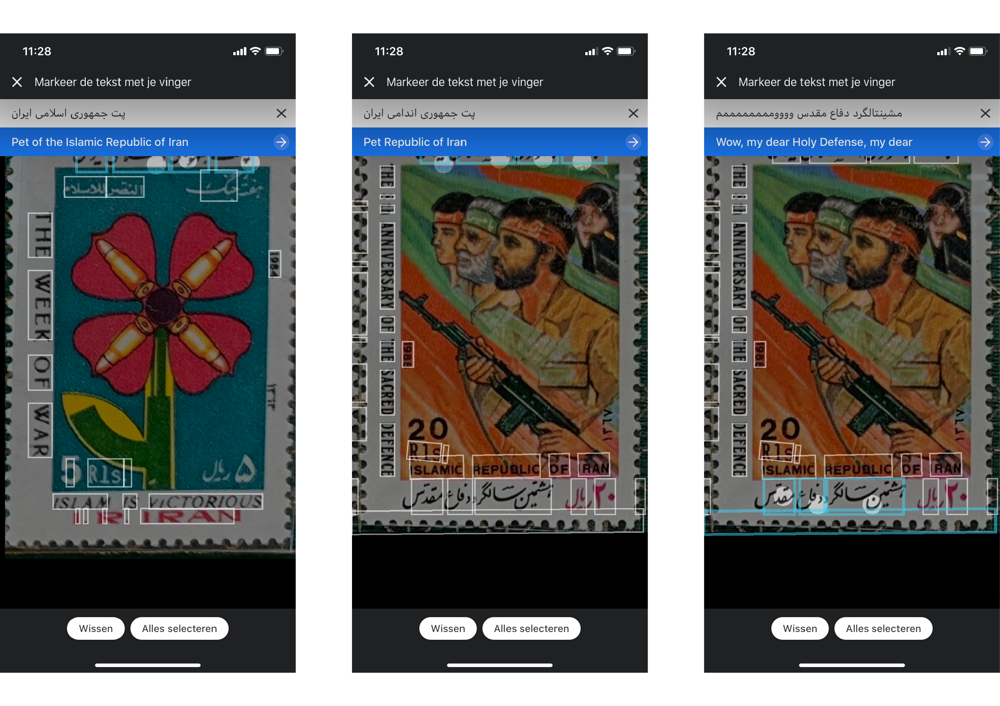

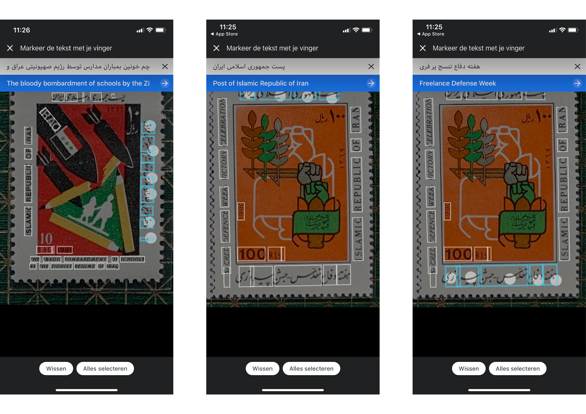

Categorizing by year and tags:

Excel sheet:

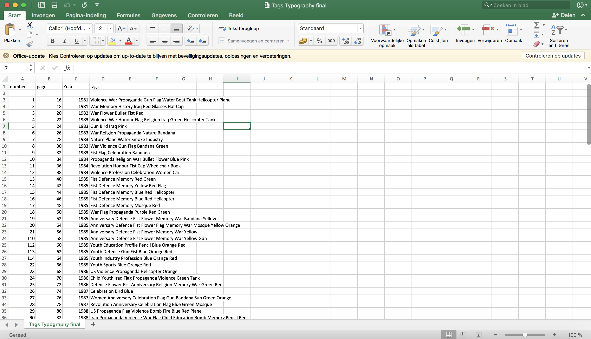

First sketches Indesign:

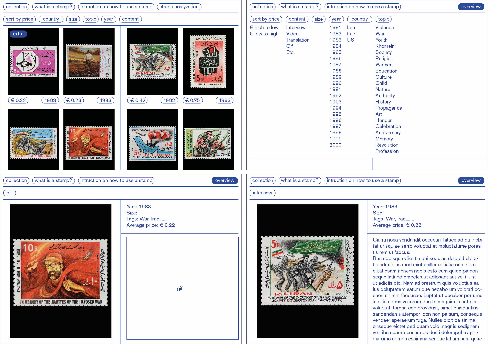

### **Results**

HTML Page:

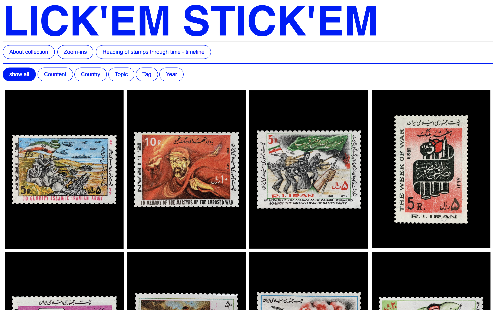

### **Source Links**

Filtering:

[Filtering](https://isotope.metafizzy.co/filtering.html)

Timeline:

[How To Create a Timeline](https://www.w3schools.com/howto/howto_css_timeline.asp)

Inspiration:

[Catalogtree 5.0](https://www.catalogtree.net)

[Atlas of Forms](http://www.atlas-of-forms.net)

## **Transcoding No. 1**

### **Description**

I created two timelines next to each other. The left one shows pictures of the postage stamps in a chronological way. The right one shows all kind on important happenings related to Iran in a chronological way. The happenings are all in some way related to the stamps. Both of the timelines can help je understand the visuals on the stamps better. You can scroll both of the timelines separately from each other. 

The aim is to make sure the user gains more knowledge about the stamps as a collection and the stamps individually and to allow the user to see the stamps in different environments. This should happen in an interactive way in which the user can narrate him/her-self through the information. Next to this, the aim for digitizing the stamps is for them to exist longer and to make them accessible for a larger crowd.

### **Methods**

I divided the page in two. Both of the sides you can scroll separately from each other. I looked up important event in/related to Iran in between 1975 and 2000. I order both the stamps and the events in a chronological way and placed them in the separate sides.

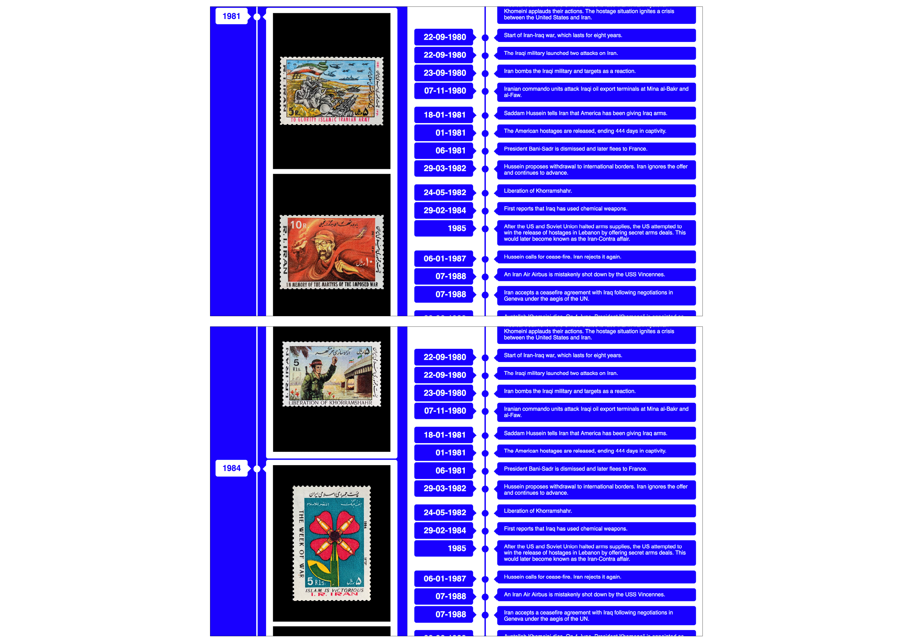

### **Tools**

Excel, HTML, JavaScript

### **Results**

[Link to outcome](https://github.com/sachavanalfen/transcoding#Outcome)

## **Transcoding No. 2**

### **Description**

When you are on the main page of the website you see an overview with all the 114 stamps, or a specific selection of those, when you click on a filter. If you want to know more about one of the stamp you can simply click on it and you will get to see additional information on the stamp. For each stamp this is different. Sometimes you only get to see additional images or a video. But most of the time it is written information about what you see on the stamp. This can be information about a specific symbol on the stamp or information about an event that is portrayed on the stamp etc.

The aim is to make sure the user gains more knowledge about the stamps as a collection and the stamps individually and to allow the user to see the stamps in different environments. This should happen in an interactive way in which the user can narrate him/her-self through the information. Next to this, the aim for digitizing the stamps is for them to exist longer and to make them accessible for a larger crowd.

### **Methods**

I used the translations of the stamp to make a few stamps with only English text. I removed all the imagery of the stamp and replaced all the text with English text. Next to this I made a few more sketches that could have been part of this project but I in the end decided not not use. In the first ones you see I removed all the text and the violent objects/imagery to make them as neutral as possible. It was a nice exercise to work on and I do think they are intersting to look at, especially next to each other, but I did not know how this would add something to my pages. Out of one of the edited stamp I made a flag, which I decided not to use, it is just part of my process.

Text only stamps (English):

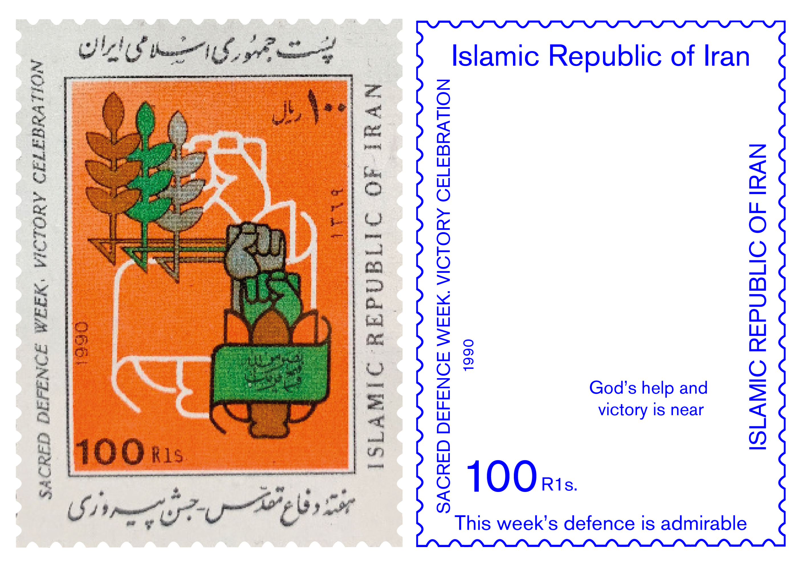

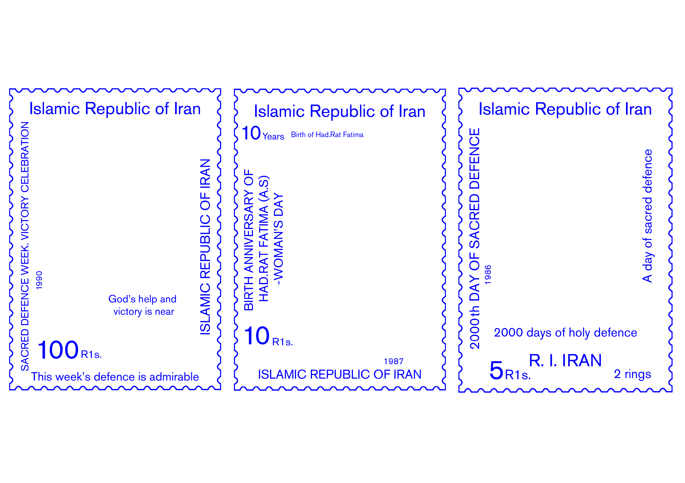

First examples of my sub pages, the layout is not done yet:

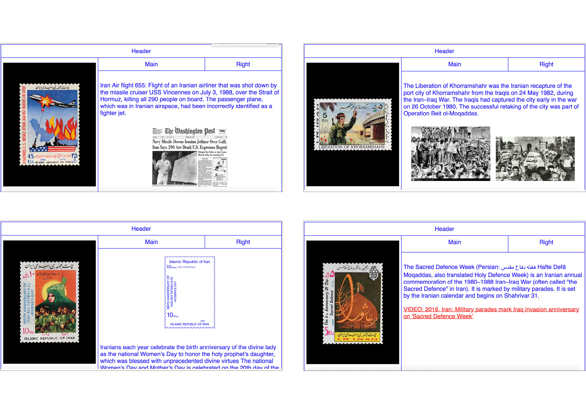

### **Tools**

HTML

### **Results**

[Link to outcome](https://github.com/sachavanalfen/transcoding#Outcome)

# **Reflection**

While is was working on this project I went in completely different directions. I made multiple of analogue sketches for transcodings, which I in the end decided not to use. Although I decided not to use them, the process of making them is still valuable. I decided that a website was going to be the platform where everything would come together. When I made the decision to only focus on the website, I noticed some sort of relieve. From this point on I had one platform to focus on, which for me really helped to improve my project and the make the website better. 

# **Outcome**

This website, where all of my transcoding’s come together, functions as a guide to understand the collection of stamps, together with the events portrayed on them, better. It allows the user to see the stamps in different environments and to filter them in different ways. The user can narrate him/her-self through all of the information in the way they want. It is supposed to be an objective tool without it making any assumptions. It is up to the user to discover and hopefully gain more knowledge. The idea is that is functions a mini archive of the stamps. Story telling is something that inspired me and I wanted my website to have this feeling. All of the stamps tell a different story, but with all of them together they tell an even bigger story. 

## Start page

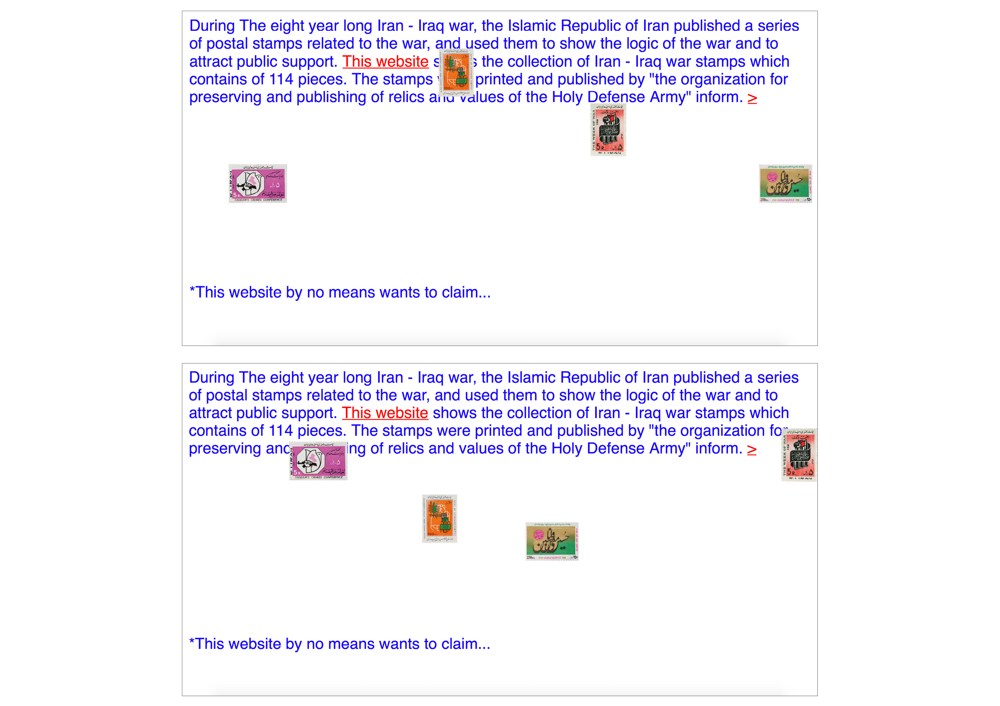

## Main page

## Sub pages

## Timeline

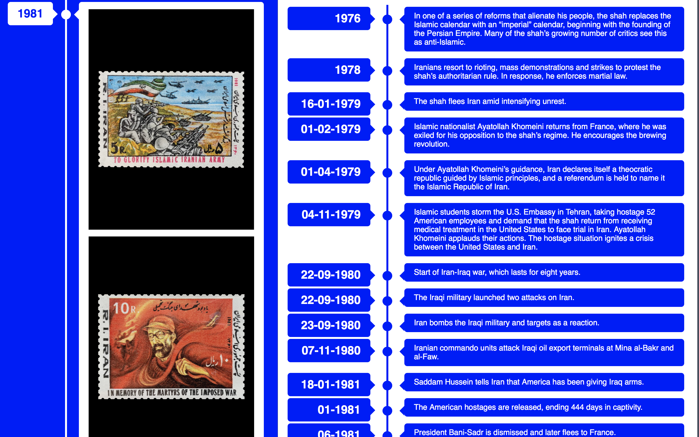

Complete website:

### **Outcome Links**

[Website](https://github.com/sachavanalfen/transcoding/web/index.html)

# **Conclusion**

I hope that with my project I managed to get a few steps closer to archival resilience. It was a nice process in which I went in a few different directions but in the end decide to choose for one platform. By working on this project my enthusiasm for stamps grew so much that I decided to start my own stamp collection. I am already the owner of a part of the collection of stamps that was published in Iran during the Iran-Iraq war!

## **Bibliography**

<a name="footnote-1">**[1]**</a>: Collection of the Eight Years War of Iran-Iraq (1980-1988): Collection of 114 Stamps of the Eight Years War of Iran - Iraq. Enclosed an Explanation By Najmuddin Kawyani and a Copy of the Catalogue of the Stamps. 2004. [Accessed 5 February 2020]

<a name="footnote-2">**[2]**</a>: Martin, T., 2018. Iran's Hidden History Now Told By Postage Stamps | Design Indaba. [online] Design Indaba. Available at: [https://www.designindaba.com/articles/creative-work/irans-hidden-history-now-told-postage-stamps](https://www.designindaba.com/articles/creative-work/irans-hidden-history-now-told-postage-stamps) [Accessed 2 May 2020].

<a name="footnote-3">**[3]**</a>: Bourton, L., 2018. Stamps Of A Revolution: Ali Mobasser's Iranian Stamp Collection And Incredible Family Story. [online] [Itsnicethat.com](http://itsnicethat.com/). Available at: [https://www.itsnicethat.com/articles/ali-mobasser-stamps-of-a-revolution-miscellaneous-280218](https://www.itsnicethat.com/articles/ali-mobasser-stamps-of-a-revolution-miscellaneous-280218) [Accessed 2 May 2020].

<a name="footnote-4">**[4]**</a>: Yardley, C., n.d. The Representation Of Science And Scientists On Postage Stamps.

<a name="footnote-5">**[5]**</a>: kopen, P., 2020. Postzegelcode. [online] PostNL. Available at: [https://www.postnl.nl/versturen/postzegels/postzegels-kopen/postzegelcode/](https://www.postnl.nl/versturen/postzegels/postzegels-kopen/postzegelcode/) [Accessed 2 May 2020].

<a name="footnote-6">**[6]**</a>: Kuang, C., 2014. A Bold Vision For The Future Of The Postage Stamp. [online] WIRED. Available at: [https://www.wired.com/2014/10/bold-vision-future-postage-stamp/](https://www.wired.com/2014/10/bold-vision-future-postage-stamp/) [Accessed 2 May 2020].

**Used for inspiration and extra research:**

Siebertz, R., 2011. PHILATELY I. The Postage Stamps Of Iran. – Encyclopaedia Iranica. [online] [Iranicaonline.org](http://iranicaonline.org/). Available at: [http://www.iranicaonline.org/articles/philately-stamps](http://www.iranicaonline.org/articles/philately-stamps) [Accessed 2 May 2020].

Skidmore, M., 2014. Opinion: Will Postage Stamps Ever Lose Their Relevance To The Design World?. [online] [Itsnicethat.com](http://itsnicethat.com/). Available at: [https://www.itsnicethat.com/articles/stamps](https://www.itsnicethat.com/articles/stamps) [Accessed 2 May 2020].

Subjective Atlas. 2020. Subjective Atlas. [online] Available at: [http://subjectiveatlas.info](http://subjectiveatlas.info/) [Accessed 2 May 2020].
